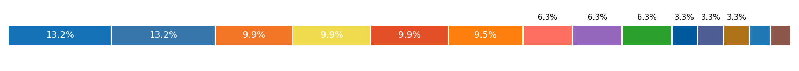

## Hi there 👋 Welcome to my workspace

I enjoy learning how new technologies work and figuring out how they can be applied to solve real problems. I like working with others to build systems—especially when the goal is to improve how people interact with information or tools.

## Toolset

## 📫 Let’s Connect
- 💼 Email - shwatgal@gmail.com
- ✉️ Drop a message to collaborate or exchange ideas around AI systems

<!--
**shtgl/shtgl** is a ✨ _special_ ✨ repository because its `README.md` (this file) appears on your GitHub profile.

Here are some ideas to get you started:

- 🔭 I’m currently working on ...
- 🌱 I’m currently learning ...
- 👯 I’m looking to collaborate on ...
- 🤔 I’m looking for help with ...
- 💬 Ask me about ...
- 📫 How to reach me: ...
- 😄 Pronouns: ...
- ⚡ Fun fact: ...
-->
